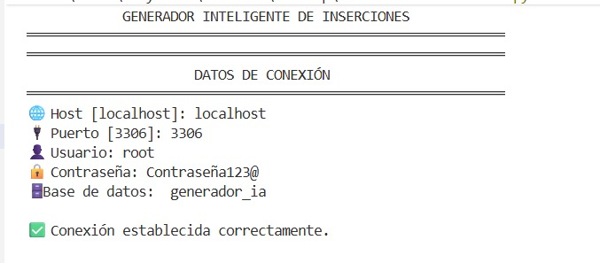

# 🤖 Generador Inteligente de Inserciones para Bases de Datos

<p align="center">
  
</p>

En el desarrollo de aplicaciones es muy común necesitar una gran cantidad de información para realizar pruebas. Sin embargo, crear estos registros manualmente requiere mucho tiempo y aumenta la probabilidad de cometer errores.
Con el objetivo de automatizar este proceso, se desarrolló una aplicación en Python capaz de conectarse a una base de datos MySQL, detectar automáticamente la estructura de una tabla y generar información compatible con los tipos de datos de cada columna.
El sistema utiliza la librería Faker para crear datos realistas, como nombres, correos electrónicos, direcciones y números telefónicos. Además, incorpora una interfaz gráfica desarrollada con Tkinter para facilitar su uso y mejorar la experiencia del usuario.
Este documento explica paso a paso cómo se desarrolló el proyecto, desde la creación de la base de datos hasta la implementación de la interfaz gráfica y las pruebas finales del sistema.

---

## 🚀 Objetivo

### Objetivo general

Desarrollar una aplicación en Python que automatice la generación e inserción de datos de prueba en tablas de una base de datos MySQL, detectando automáticamente la estructura de las tablas y generando información compatible con cada tipo de dato.

### Objetivos específicos

- Establecer una conexión entre Python y MySQL. 
- Detectar automáticamente las columnas de una tabla. 
- Generar datos realistas mediante la librería Faker. 
- Insertar automáticamente los registros generados. 
- Implementar una interfaz gráfica amigable. 
- Registrar errores y mostrar estadísticas del proceso. 

---

## ✨ Características

- 🔌 Conexión a MySQL
- 📋 Detección automática de tablas
- 🧠 Generación inteligente de datos según tipo de columna
- 💖 Interfaz gráfica (Tkinter) 
- 👀 Vista previa de datos generados
- 💾 Inserción automática en la base de datos
- 📊 Estadísticas del proceso
- 🪵 Registro de errores en logs
- 🎲 Uso de datos realistas con Faker

---

## 🛠️ Herramientas utilizadas

Durante el desarrollo del proyecto se utilizaron las siguientes herramientas:

| Herramienta | Función |
|-------------|---------|
| Python 3 | Lenguaje de programación principal |
| Visual Studio Code | Editor de código |
| MySQL Server | Motor de base de datos |
| MySQL Workbench | Administración de la base de datos |
| mysql-connector-python | Conexión entre Python y MySQL |
| Faker | Generación de datos realistas |
| Tkinter | Desarrollo de la interfaz gráfica |
| GitHub | Control de versiones y almacenamiento del proyecto |

---

## 📂 Estructura del proyecto
```text
GeneradorIA/
│
├── main.py
├── ui.py
├── conexion.py
├── generador.py
├── inserciones.py
├── exportar.py
│
└── logs/
    └── errores.log
```

---

## 🧠 Uso de Inteligencia Artificial

Aunque el proyecto no utiliza modelos de inteligencia artificial generativa, emplea la librería Faker para generar datos sintéticos y realistas de forma automática. Esto permite producir información coherente para realizar pruebas en bases de datos sin utilizar datos reales.

## 📋 Requisitos

- Python 3.11 o superior
- MySQL Server
- MySQL Workbench (opcional)
- pip

---

## ⚙️ Instalación

```bash
git clone https://github.com/tuusuario/generador-ia.git
cd generador-ia
pip install -r requirements.txt
```

## 🚀 Mejoras futuras

- Soporte para PostgreSQL y SQLite
- Exportación a Excel
- Interfaz web
- Detección avanzada de llaves foráneas


## 🔧 Configuración

Editar conexion.py:

```python
host="localhost"
user="root"
password="tu_contraseña"
database="generador_ia"
```

## ▶️ Ejecución
### Consola:

```bash
python main.py
```



**Figura 1. Proyecto ejecutandose en la terminal.


### Interfaz gráfica

```bash
python ui.py
```


**Figura 2. Interfaz grafica.


---

## 📄 Licencia

Este proyecto fue desarrollado con fines académicos.